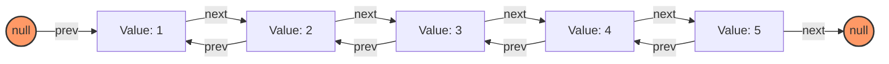

# Doubly Linked List Implementation in JavaScript

## Overview

A doubly linked list is a data structure where each node contains references to both the next and the previous nodes, allowing for bidirectional traversal.



## Node Structure

Each node in the doubly linked list has the following properties:

- `data`: The data(value) stored in the node.
- `next`: A reference to the next node.
- `prev`: A reference to the previous node.

## List Structure

The doubly linked list contains the following properties:

- `head`: A reference to the first node.
- `tail`: A reference to the last node.

## Code

Javascript code for doubly linked list is available from [here](https://github.com/Devendra616/DSA/blob/main/3.linkedList/doublyLinkedList.js).

## Usage

Below are examples of how to use the doubly linked list:

Below are examples of how to use the doubly linked list:

```javascript
const dll = new DoublyLinkedList();
dll.insertAtBeginning(10);
dll.insertAfterValue(10, 20);
dll.insertAfterValue(40, 30);
dll.printList();
dll.insertAtEnd(40);
dll.insertAtEnd(50);
dll.insertAtEnd(60);
dll.printList();
dll.reverse();
dll.printList();
```
