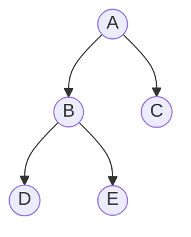
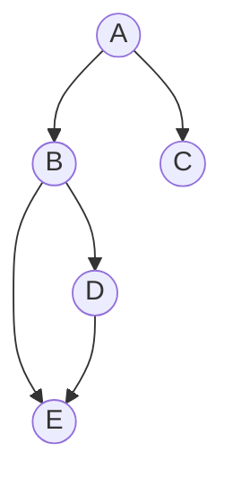
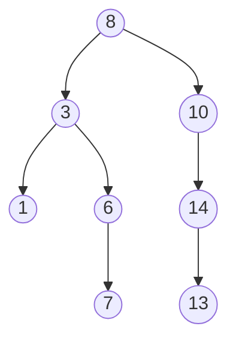
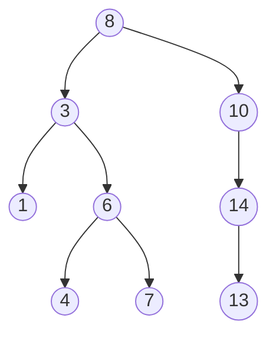
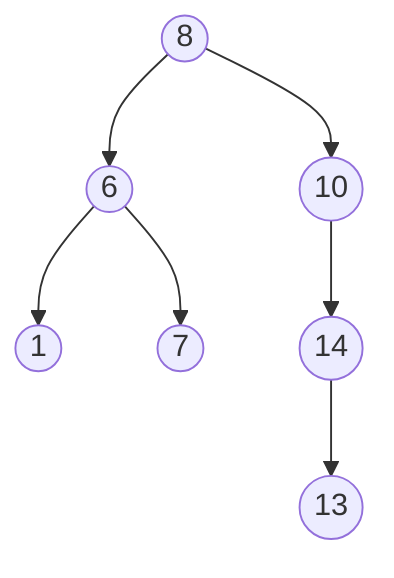

# Binary Tree

A binary tree is a tree data structure in which each node has at most two children, referred to as the left child and the right child. It has the following properties:
- **At most 2 children:** Each node can have 0, 1, or 2 children.
- **Exactly 1 root:** There is one root node from which all other nodes descend.
- **Leaf nodes:** Nodes without children are called leaves.
- **Unique path:** There is exactly one path between the root and any other node.
- **Empty tree:** A tree with no nodes is still considered a binary tree.

### Illustration of a Binary Tree
Below is a Binary Tree 

Below is **Not** a Binary Tree
This diagram represents the non-binary tree structure where node E has two parents, which violates the binary tree property of having at most one parent. Also there are multiple paths from A to E.

A -> B -> E and 
A -> B -> D -> E


## Binary Search Tree (BST)
A BST is a special type of binary tree where:
- **Left subtree** contains only nodes with keys less than the node's key.
- **Right subtree** contains only nodes with keys greater than the node's key.
- **BST property:** Both the left and right subtrees must also be BSTs.

### BST Node Structure
```javascript
class TreeNode {
  constructor(key) {
    this.key = key;
    this.left = null;
    this.right = null;
  }
}
```

### Illustration of a BST
```
In this BST, all nodes in the left subtree of 8 are less than 8, and all nodes in the right subtree are greater than 8. The same property holds for every node in the tree.
     8
    / \
   3   10
  / \    \
 1   6    14
    / \   /
   4   7 13
```
**Note:** In practice, BSTs are used to implement efficient searching algorithms. The structure of a BST allows operations like search, insert, delete, and find min/max to be performed efficiently.

### Insertion in BST

Inserting a new node into a BST follows a specific path from the root, based on the value to be inserted. Here's how it works:

1. **Start at the root node.**
2. **Compare the value to be inserted with the current node's key.**
3. **If the value is less than the current node's key, go to the left child.**
4. **If the value is greater than the current node's key, go to the right child.**
5. **Repeat steps 2-4 until you find an empty spot where the new node should be inserted.**
6. **Insert the new node at that empty spot.**

## Example: Inserting `5` into a BST

Consider we have the following BST and we want to insert `5`:


Step-by-Step Insertion of 5<br>
Start at 8 <br>
Since 5 is less than 8, go left.<br>
At 3, 5 is greater, so go right.<br>
At 6, 5 is less, so go left.<br>
The left child of 6 is empty, so insert 5 there.<br>

After insertion, the BST looks like this:<br>

## Video Example for Insertion in BST

<video width="320" height="240" controls>
  <source src="../assets/videos/insertion in bst.mp4" type="video/mp4">
  Your browser does not support the video tag.
</video>

## Deletion in BST

Deleting a node from a BST requires consideration of three main cases:

1. **Node with no children (Leaf node):** Simply remove the node from the tree.
2. **Node with one child:** Remove the node and replace it with its child.
3. **Node with two children:** Find the in-order successor (smallest value in the right subtree) or in-order predecessor (largest value in the left subtree). Replace the node with the in-order successor/predecessor, then delete the successor/predecessor from its original position.

## Example: Deleting `6` from a BST

Consider we have the following BST and we want to delete `3`:


To delete 3 using the in-order predecessor, we will find the largest node in its left subtree, which is 1 in this case. Here’s how we can proceed:

Find the in-order predecessor of 3, which is the largest node in its left subtree, 1.<br>
Replace 3 with 1.
Since 1 was a leaf node, we simply remove it.

Here’s the updated BST after deleting 3 using its in-order predecessor:


## Video Example for Deletion in BST

<video width="320" height="240" controls>
  <source src="../assets/videos/deletion in BST.mp4" type="video/mp4">
  Your browser does not support the video tag.
</video>


