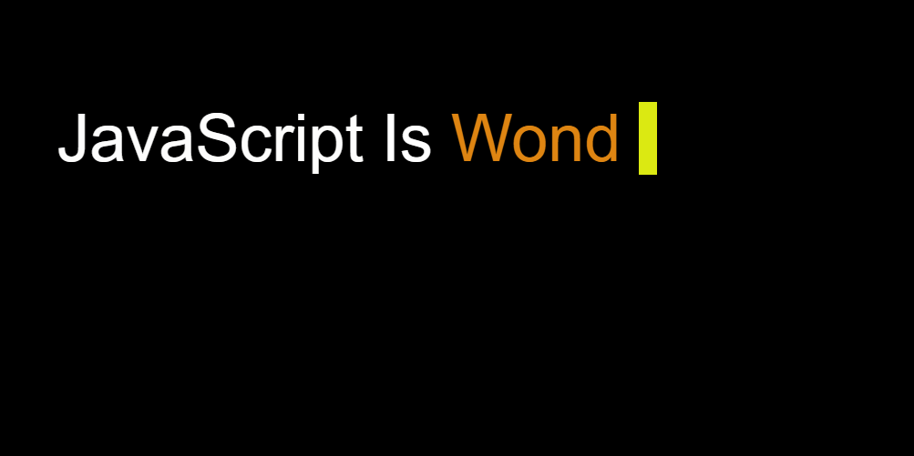
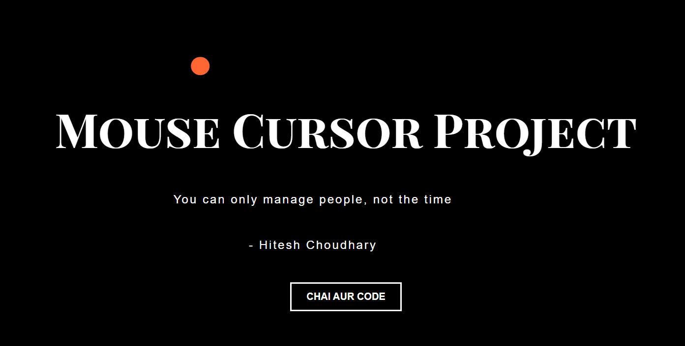

# Machine Coding

## 1. Scroll

### Task

- Create a scroll indicator that will show the progress of the page as the user scrolls down the page.
- The progress bar should be a red bar that fills up as the user scrolls down the page.
- The progress bar should be 10px in height.
- The progress bar should start at 0% and increase to 100% as the user scrolls down the page.
- The progress bar should have a smooth animation when the user scrolls down the page.

### Screenshot


### Code Link

[Link to Code](./1.scroll)

## 2. Typer Library

### Task

- Create a typer library that will type out the text provided in array.
- It should animate the typing of text and provide a delay between each letter.

### Screenshot



### Code Link

[Link to Code](./2.typer_library)

## 3. Mouse Cursor

### Task

- Create a mouse cursor that will move on the screen when the user moves the mouse.
- The cursor should be a circle that moves on the screen when the user moves the mouse.
- The cursor should have a random color that changes as the user moves the mouse.
- The cursor should have a smooth animation when the user moves the mouse.

### Screenshot



### Code Link

[Link to Code](./3.mouseCircle)

## 4. Change Emoji

### Task

- As a user hover the mouse over emoji, get a new emoji.
- As the user moves away mouse turn it into gray-scale

### Screenshot


### Code Link

[Link to Code](./4.changeEmoji)

## 5. Text Editor

### Task

- Create a text editor that will allow the user to type text.
- The editor has input field and output field.
- There are 5 buttons that will format the text.
- The buttons are ABC, abc, Abc, B, /, and ABC.
- The ABC button will make the text uppercase.
- The abc button will make the text lowercase.
- The Abc button will make the text capitalized.
- The B button will make the text bold.
- The / button will make the text italic.
- The ABC button will make the text underlined.
- The output field will show the formatted text.

### Screenshot


### Code Link

[Link to Code](./5.textEditor)

## 6. Random Image

### Task

- Create a random image feed that will show a random image every time the user clicks the button.
- The image feed should have 4 rows and 3 columns.
- The image should not be from API.

### Screenshot


### Code Link

[Link to Code](./6.randomImage)

## 7. Race Condition

Race condition in JavaScript is a situation where two or more asynchronous operations are executed in an order that is different from the order in which they were initiated. A race condition in JavaScript occurs when two or more operations attempt to modify shared data at the same time, leading to unpredictable results. Although JavaScript is single-threaded, race conditions can still happen due to its asynchronous nature, where multiple asynchronous operations can overlap in execution.

For example, when we click a button to fetch data from an API, the data fetching operation may take longer. If the user clicks the button again before the first request is completed, the second request may be sent before the first one is completed, leading to a race condition where the data is fetched twice. The result of the second request will overwrite the result of the first request. This can lead to unexpected behavior and bugs in the application.
To avoid this we can use async await or promises to handle the race condition.

In race condition, both requests are executed but the result of the second request overwrites the result of the first request.

### Task

- Create a demo that will show the race condition in JavaScript.

### Screenshot


### Code Link

[Link to Code](./7.raceCondition)

## 8. Debounce in JavaScript

Debounce is a technique used to limit the number of times a function is executed when it is called repeatedly. It is often used to prevent the function from being executed too frequently, such as when a user types in a search box.

The debounce function takes a function as an argument and _returns a new function_ that will call the original function only after a certain amount of time has passed without it being called.

### Use Case

- Search Box Suggestions: Triggering search suggestions only after the user has stopped typing.
- Form Auto-Save: Saving form data only after the user has stopped making changes.
- Button Clicks: Preventing multiple clicks on a button from triggering multiple actions.

### Task

- Create a demo that will show the debounce in JavaScript.
- With each character typed in search box, make an API call to randomuserme api and display a card below it. Use debounce concept to reduce api calls.

### Screenshot


### Code Link

[Link to Code](./8.debounce)

## 9. Mask Card

### Task

- The user enters the card number and the function will generate masked card number.
- The first digit and last 4 digits of the card number will not be masked.
- The middle digits will be masked with X.
- If there is any separator in the card number, it will be same.

### Example

4556-3646-0793-5616 ==> 4###-####-####-5616
5512103073210694 ===> 5###########0694

### Code Link

[Link to Code](./9.maskCard/maskCard.js)

## 10. Pipe Function

Pipe function is a function that takes an input and passes it to the next function in the chain. It is used to pass the output of one function to another function.

In JavaScript, pipe function is implemented using the `|` operator. The `|` operator takes the input and passes it to the next function in the chain.

### task

- Create a pipe function that takes an input and passes it to the next function in the chain.

### Example

```js
const add = (a, b) => a + b;
const multiply = (a) => a * 2;
const subtract = (a) => a - 1;
pipe(add, multiply, subtract)(5, 2); //13
```

### Code Link

[Link to Code](./10.pipe/pipe.js)
